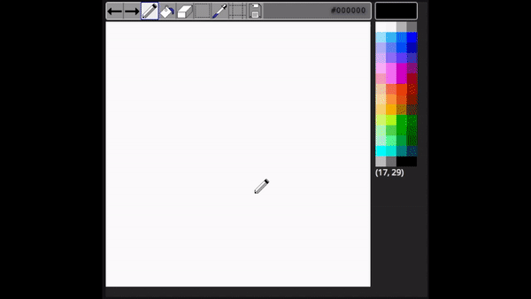
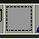

# pixel paint

A spirte art tool for making 32x32 sprites with the NES Palette

## features
- [x] written in 100% vanilla javascript
- [x] save your pixel creation as a PNG
- [x] toggle grid (press `G`)
- [x] pencil, fill, eraser, selection and colorpicker tools
- [x] handmade png cursor and button images

## how to use selection tool

1. Press the selection tool button 
2. Click and drag across the canvas to create rectangular outline
3. After you release the mouse you can copy and move copied selection by doing the following
    - hold `Alt`
    - click within the rectangular outline (this copies the selection)
    - move your mouse, dragging the copied selection across the canvas
    - release the mouse to lock the copied selection to the canvas

## hotkeys

| Command          | Hotkey              |
| :--------------- | :------------------ |
| pencil mode      | P                   |
| bucket mode      | B                   |
| mode eraser mode | E                   |
| colorpicker mode | V                   |
| selection mode   | S                   |
| copy selection   | ALT+click and drag  |
| remove selection | Esc                 |
| toggle grid      | G                   |
| undo             | Z                   |
| redo             | X                   |
